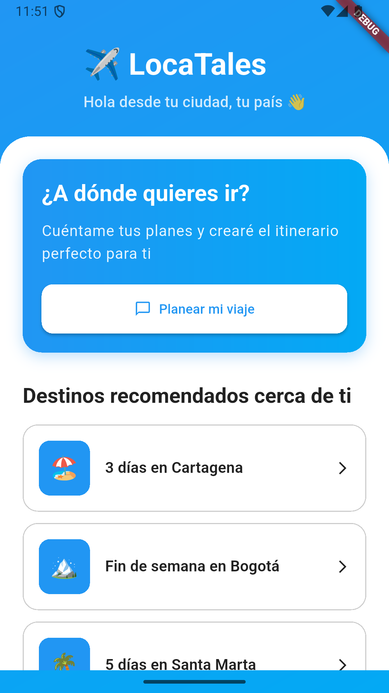
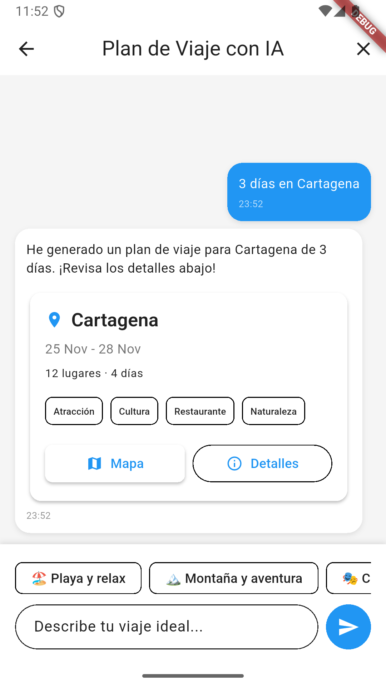
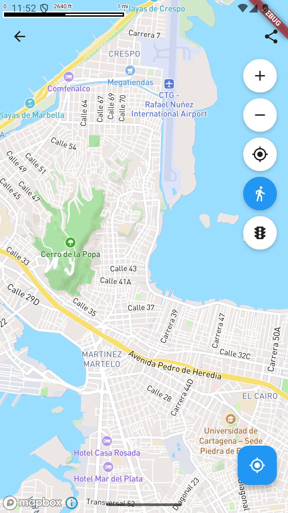
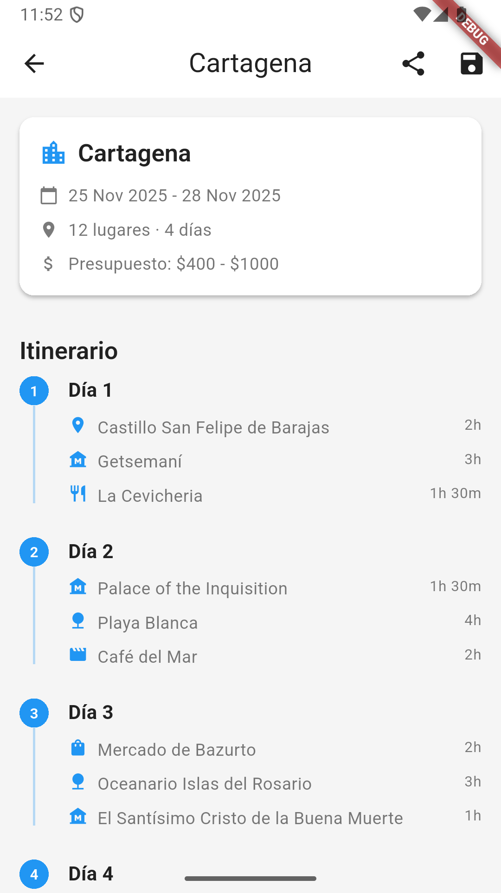
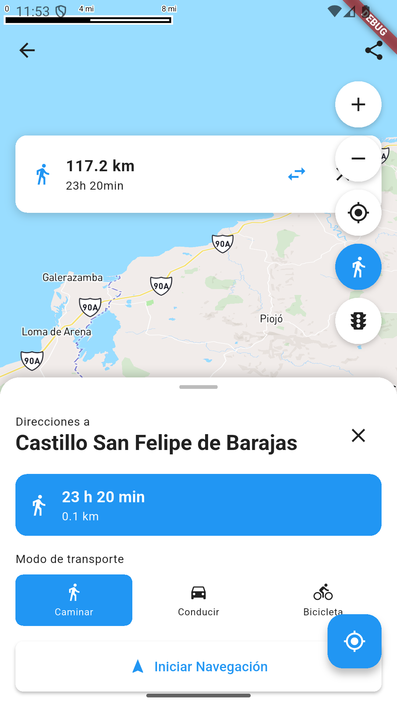

# ✈️ LocaTales - AI Travel Planner

> Tu asistente de viajes inteligente que crea itinerarios personalizados con IA y te guía con mapas interactivos.

**LocaTales** es una aplicación móvil Flutter que combina la potencia de Google Gemini AI con mapas interactivos de Mapbox para crear experiencias de viaje únicas y personalizadas.

<p align="center">
  
  
  
  
</p>

## ✨ Características Principales

### 🤖 Asistente de Viajes con IA
- **Chat conversacional** con Google Gemini para crear planes personalizados
- **Generación automática** de itinerarios día por día
- **Recomendaciones inteligentes** de lugares, restaurantes y actividades
- **Sugerencias adaptadas** a tu ubicación actual

### 🗺️ Mapas Interactivos
- **Visualización en tiempo real** de todos los destinos de tu plan
- **Cálculo de rutas** con Mapbox Directions API
- **Múltiples modos de transporte**: 🚶 Caminar, 🚗 Conducir, 🚴 Bicicleta
- **Navegación externa** con Mapbox Navigation, Google Maps o Apple Maps
- **Marcadores personalizados** por categoría de lugar
- **Validación de distancias** (límite de 500km para rutas terrestres)

### 🎨 Experiencia de Usuario
- **Diseño moderno** con Material Design 3
- **Gradientes y animaciones** fluidas
- **Modo oscuro** completo
- **Sugerencias rápidas** basadas en ubicación
- **Interfaz intuitiva** y responsive

### 📍 Personalización por Ubicación
- **Detección automática** de tu ciudad
- **Recomendaciones locales** adaptadas a tu región
- **Sugerencias de destinos cercanos**

## 📸 Capturas de Pantalla

<p align="center">
  
  
  
</p>

<p align="center">
  
  
  
</p>

## 🚀 Inicio Rápido

### Opción 1: Clonar y Ejecutar

```bash
# 1. Clonar el repositorio
git clone https://github.com/tu-usuario/loca_tales.git
cd loca_tales

# 2. Instalar dependencias
flutter pub get

# 3. Configurar API Keys (ver SETUP.md)
# Edita los archivos de configuración con tus tokens

# 4. Generar código
flutter pub run build_runner build --delete-conflicting-outputs

# 5. Ejecutar en modo desarrollo
flutter run --flavor development -t lib/main_development.dart
```

### Opción 2: Configuración Detallada

Para una configuración paso a paso con explicaciones detalladas, consulta [SETUP.md](SETUP.md).

## 📋 Requisitos Previos

- Flutter SDK 3.24+
- Dart SDK 3.9.2+
- Cuenta de Google AI Studio (para Gemini API)
- Cuenta de Mapbox (para mapas y geocodificación)

## 🛠️ Instalación

1. **Clonar el repositorio**
   ```bash
   git clone <repository-url>
   cd loca_tales
   ```

2. **Instalar dependencias**
   ```bash
   flutter pub get
   ```

3. **Configurar API Keys**
   
   Consulta [SETUP.md](SETUP.md) para instrucciones detalladas sobre cómo configurar:
   - Google Gemini API Key
   - Mapbox Access Token

4. **Generar código**
   ```bash
   flutter pub run build_runner build --delete-conflicting-outputs
   ```

## 🏃 Ejecutar la Aplicación

### Desarrollo
```bash
flutter run --flavor development -t lib/main_development.dart
```

### Staging
```bash
flutter run --flavor staging -t lib/main_staging.dart
```

### Producción
```bash
flutter run --flavor production -t lib/main.dart
```

## 📱 Estructura del Proyecto

```
lib/
├── config/              # Configuración (environment, theme, constants)
│   ├── environment/     # Variables de entorno y flavors
│   ├── theme/           # Temas de la aplicación
│   └── constants/       # Constantes de API y app
│
├── domain/              # Capa de Dominio (Lógica de Negocio)
│   ├── models/          # Modelos de dominio
│   ├── repositories/    # Interfaces de repositorios
│   └── use_cases/       # Casos de uso
│
├── data/                # Capa de Datos
│   ├── models/          # DTOs y mappers
│   ├── services/       # Servicios externos (Gemini, Mapbox)
│   └── repositories/    # Implementaciones de repositorios
│
├── ui/                  # Capa de Presentación
│   ├── chat/            # Feature de Chat
│   ├── map/             # Feature de Mapa
│   └── plan_detail/     # Feature de Detalle del Plan
│
└── routing/             # Configuración de navegación
```

## 🏗️ Arquitectura

La aplicación sigue **Clean Architecture** con separación en 3 capas:

1. **Domain Layer**: Lógica de negocio pura, sin dependencias externas
2. **Data Layer**: Acceso a datos (APIs, almacenamiento local)
3. **Presentation Layer**: UI con MVVM y Riverpod

### Patrones Utilizados

- **MVVM**: Model-View-ViewModel para la UI
- **Repository Pattern**: Abstracción del acceso a datos
- **Use Cases**: Lógica de negocio encapsulada
- **Dependency Injection**: Riverpod para inyección de dependencias

## 🧪 Testing

```bash
# Ejecutar todos los tests
flutter test

# Ejecutar con cobertura
flutter test --coverage
```

## 📦 Dependencias Principales

### Core
- **flutter_riverpod** `^2.6.1`: Gestión de estado reactiva
- **riverpod_annotation** `^2.6.1`: Generación de código para Riverpod
- **go_router** `^14.6.2`: Navegación declarativa y type-safe

### IA y APIs
- **google_generative_ai** `^0.4.6`: Integración con Google Gemini
- **dio** `^5.7.0`: Cliente HTTP para llamadas a APIs
- **retrofit** `^4.4.1`: Cliente REST type-safe

### Mapas y Ubicación
- **mapbox_maps_flutter** `^2.3.0`: Mapas interactivos de Mapbox
- **geolocator** `^13.0.2`: Servicios de geolocalización
- **permission_handler** `^11.3.1`: Manejo de permisos
- **url_launcher** `^6.3.1`: Abrir apps externas de navegación

### UI y Utilidades
- **freezed** `^2.5.7`: Clases inmutables y union types
- **cached_network_image** `^3.4.1`: Caché de imágenes
- **intl** `^0.20.1`: Internacionalización y formateo
- **shared_preferences** `^2.3.3`: Persistencia local

### Desarrollo
- **build_runner** `^2.4.13`: Generación de código
- **freezed_annotation** `^2.4.4`: Anotaciones para Freezed
- **json_serializable** `^6.8.0`: Serialización JSON

## 🔧 Configuración Adicional

### Android

**Permisos en `AndroidManifest.xml`:**
```xml
<uses-permission android:name="android.permission.INTERNET"/>
<uses-permission android:name="android.permission.ACCESS_FINE_LOCATION"/>
<uses-permission android:name="android.permission.ACCESS_COARSE_LOCATION"/>
```

**Mapbox Token en `android/app/src/main/res/values/strings.xml`:**
```xml
<string name="mapbox_access_token">TU_MAPBOX_TOKEN</string>
```

**Queries para navegación externa:**
```xml
<queries>
  <intent>
    <action android:name="android.intent.action.VIEW" />
    <data android:scheme="mapbox" />
  </intent>
  <intent>
    <action android:name="android.intent.action.VIEW" />
    <data android:scheme="https" />
  </intent>
</queries>
```

### iOS

**Permisos en `Info.plist`:**
```xml
<key>NSLocationWhenInUseUsageDescription</key>
<string>Necesitamos tu ubicación para mostrarte lugares cercanos</string>
<key>NSLocationAlwaysAndWhenInUseUsageDescription</key>
<string>Necesitamos tu ubicación para crear rutas personalizadas</string>
```

**Mapbox Token en `Info.plist`:**
```xml
<key>MBXAccessToken</key>
<string>TU_MAPBOX_TOKEN</string>
```

**URL Schemes para navegación:**
```xml
<key>LSApplicationQueriesSchemes</key>
<array>
  <string>mapbox</string>
  <string>comgooglemaps</string>
  <string>maps</string>
</array>
```

## 🎯 Roadmap

- [ ] Integración con servicios de reservas (hoteles, vuelos)
- [ ] Compartir planes de viaje con amigos
- [ ] Modo offline con mapas descargados
- [ ] Recomendaciones basadas en preferencias del usuario
- [ ] Integración con redes sociales
- [ ] Soporte multiidioma
- [ ] Widget de clima en tiempo real

## 🐛 Problemas Conocidos

- Las rutas están limitadas a 500km (limitación de Mapbox Directions API)
- La detección de ciudad es básica y puede mejorarse con geocoding inverso
- Algunas animaciones pueden ser lentas en dispositivos de gama baja

## 🤝 Contribuir

¡Las contribuciones son bienvenidas! Por favor:

1. Fork el proyecto
2. Crea una rama para tu feature (`git checkout -b feature/AmazingFeature`)
3. Commit tus cambios (`git commit -m 'Add some AmazingFeature'`)
4. Push a la rama (`git push origin feature/AmazingFeature`)
5. Abre un Pull Request

## 📝 Licencia

Este proyecto está bajo desarrollo activo. Todos los derechos reservados.

## 👨‍💻 Autor

Desarrollado con ❤️ por [Javier Guevara]

## 📞 Contacto

Para problemas, preguntas o sugerencias:
- 📧 Email: jg131997@gmail.com
- 🐛 Issues: [GitHub Issues](https://github.com/javier-guevara/loca_tales/issues)
- 📖 Documentación: [SETUP.md](SETUP.md)

---

<p align="center">
  <strong>Hecho con Flutter 💙</strong>
</p>
